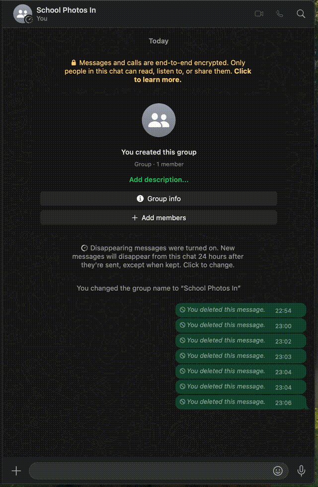

# Just My Kids

A simple WhatsApp bot that filters group photos and only notifies you when your kids appear. No more scrolling through hundreds of kindergarten photos to find your little ones!



## The Problem This Solves

Parents know the struggle - you're added to a school WhatsApp group that gets flooded with photos, but you only care about the ones with your own children. This little tool filters through all those images automatically so you don't have to.

## How It Works

1. Monitors your WhatsApp groups in the background
2. Uses face recognition to identify your children
3. Sends you a notification only when your kids appear in photos
4. Ignores all the other images

No more notification fatigue or endless scrolling!

## Features

- 🔍 **Smart filtering**: Only alerts you about photos with your kids
- 👨‍👩‍👧‍👦 **Multiple kids**: Set it up for all your children at once
- 🖼️ **Works with most images**: Handles JPG, PNG, HEIC formats
- 📱 **WhatsApp notifications**: Get alerts right in your preferred chat
- 🛠️ **Easy to customize**: Simple settings in a single config file

## Prerequisites

- Python 3.8+
- Go 1.16+
- WhatsApp account
- [face_recognition](https://github.com/ageitgey/face_recognition) library and its dependencies

## Quick Start

1. Clone this repo
2. Drop a few face photos of your kids in folders under `reference_images/`
3. Set up your config to monitor your school groups
4. Run the scripts and forget about endless photo scrolling!

## Installation

1. Clone the repository:
```bash
git clone https://github.com/Yakirbe/just-my-kids.git
cd just-my-kids
```

2. Install Python dependencies:
```bash
pip install -r requirements.txt
```

3. Install Go dependencies:
```bash
cd whatsapp-bridge
go mod download
```

## Setup

### 1. WhatsApp Client Setup

1. Start the WhatsApp bridge:
```bash
cd whatsapp-bridge
go run main.go
```

2. On first run, you'll see a QR code in the terminal. Scan it with WhatsApp to log in.

3. After logging in, the client will start outputting information about your chats. Look for lines like:
```
[GROUP] Name: Family Group (JID: 123456789012345678@g.us)
```
Take note of the group IDs (the numbers ending with @g.us) - you'll need these for configuration.

### 2. Getting Group IDs

There are several ways to find the group IDs needed for configuration:

1. **Using the list-groups command flag:**
   The simplest method is to use the `-list-groups` flag:
   ```bash
   cd whatsapp-bridge
   go run main.go -list-groups
   ```
   This will connect to WhatsApp, list all your groups with their IDs, and exit.

2. **From the connected client log:**
   When you run `go run main.go` and log in, look for these lines:
   ```
   [GROUPS] Found X groups:
   [GROUP] Name: Group Name (JID: 123456789012345678@g.us)
   ```

3. **From incoming messages:**
   In active groups, you'll see log entries like:
   ```
   [MESSAGE] Processing incoming message event
   ```
   followed by details including the chat JID.

### 3. Reference Images Setup

1. Create the main reference images directory:
```bash
mkdir reference_images
```

2. Create a subdirectory for each person:
```bash
cd reference_images
mkdir child1 child2 child3
```

3. Add multiple reference photos for each person:
```
reference_images/
  ├── child1/
  │   ├── front.jpg
  │   ├── side.jpg
  │   └── smiling.jpg
  ├── child2/
  │   ├── photo1.jpg
  │   ├── photo2.jpg
  │   └── photo3.jpg
  └── child3/
      ├── indoor.jpg
      └── outdoor.jpg
```

#### Reference Photo Best Practices:

- **Quantity matters**: 5-10 different photos per person will significantly improve accuracy
- **Include variety**: Different angles, expressions, lighting conditions, and backgrounds
- **Quality matters**: Use good quality, well-lit photos without motion blur
- **One face per image**: Ensure each reference photo contains exactly one face
- **Diverse environments**: Mix indoor and outdoor photos for better environmental adaptability
- **Expression range**: Include both neutral and expressive faces (smiling, serious, etc.)
- **Recent photos**: Use recent photos that match current appearance
- **Supported formats**: jpg, jpeg, png, heic

> **Pro tip**: The more reference images you provide and the more diverse they are, the better the system will perform at detecting faces in various conditions.

### 4. Configuration

The configuration file `config.json` controls all aspects of the system. Here's what each section means:

#### Input Groups (`input_groups`)
- List of WhatsApp group IDs to monitor for incoming images
- Format: `"XXXXXXXXXX@g.us"` or phone number-based group IDs
- Example: `"123456789012345678@g.us"`

#### Destinations (`destinations`)
Each person you want to monitor needs:
1. A directory of reference images in the `known_faces_dir` directory
2. A corresponding entry in the `destinations` configuration

Example configuration:
```json
"child1": {
    "name": "Child One",
    "group": "+1234567890"
}
```

- The key (`child1`) must match the directory name containing reference images
- `name`: Display name used in notifications
- `group`: WhatsApp group ID or phone number to send notifications to

#### Media Settings (`media`)
```json
"media": {
    "allowed_extensions": [".jpg", ".jpeg", ".png", ".heic", ".HEIC"],
    "store_path": "whatsapp-bridge/store/media"
}
```

- `allowed_extensions`: List of image file types to process
- `store_path`: Directory where incoming media files are temporarily stored

#### Face Detection Settings (`face_detection`)
```json
"face_detection": {
    "known_faces_dir": "reference_images",
    "min_matching_faces": 2,
    "confidence_threshold": 0.5,
    "model": "hog"
}
```

- `known_faces_dir`: Directory containing reference images
- `min_matching_faces`: How many reference photos need to match for positive identification
- `confidence_threshold`: Face distance threshold (0.0-1.0)
  - This is actually a distance metric: lower values = better matches
  - Recommended values: 0.4-0.6 (lower is stricter, higher is more permissive)
  - Lower values (e.g., 0.4) = fewer false positives but may miss some matches
  - Higher values (e.g., 0.6) = more matches but potentially more false positives
  - Recommended starting point: 0.5
- `model`: Face detection algorithm to use
  - `hog`: Faster processing, works well in most scenarios
  - `cnn`: More accurate but significantly slower, recommended for critical use cases or if running on powerful hardware

> **Note on Reference Images**: 
> The more reference images you provide per person, the better the system's accuracy. 
> Including 5-10 diverse high-quality images per person can significantly improve detection rates 
> and reduce false positives.

#### Debug Settings (Optional)
```json
"debug": {
    "enabled": false,
    "output_dir": "debug_output"
}
```

- `enabled`: Set to true to enable debug mode
- `output_dir`: Directory where debug information will be stored

#### Example Configuration

```json
{
    "input_groups": [
        "GROUP_ID1",
        "GROUP_ID2"
    ],
    "destinations": {
        "child1": {
            "name": "Child One",
            "group": "+MYSELF"
        },
        "child2": {
            "name": "Child Two",
            "group": "+MY_HUSBAND"
        }
    },
    "media": {
        "allowed_extensions": [".jpg", ".jpeg", ".png", ".heic", ".HEIC"],
        "store_path": "whatsapp-bridge/store/media"
    },
    "face_detection": {
        "known_faces_dir": "reference_images",
        "min_matching_faces": 2,
        "confidence_threshold": 0.5,
        "model": "hog"
    },
    "debug": {
        "enabled": false,
        "output_dir": "debug_output"
    }
}
```

### 5. Start the System

1. Start the WhatsApp bridge (if not already running):
```bash
cd whatsapp-bridge
go run main.go
```

You can also specify a custom port for the REST API (default is 8080):
```bash
go run main.go -port 8888
```

2. In a new terminal, start the face detection service:
```bash
python face_filter_service.py
```

### 6. Optional: Chat with Your WhatsApp Data (AI Integration)

Want to search or chat about your WhatsApp messages with Claude or Cursor? You can connect the WhatsApp MCP server to your favorite AI assistant:

#### Claude Desktop Setup
1. Find your Python path by running `which python` in your terminal
2. Create a config file at `~/Library/Application Support/Claude/claude_desktop_config.json`:
```json
{
  "mcpServers": {
    "whatsapp": {
      "command": "/path/to/python", 
      "args": [
        "--directory",
        "/full/path/to/just-my-kids/whatsapp-mcp-server",
        "run",
        "main.py"
      ]
    }
  }
}
```
3. Replace `/path/to/python` with your actual Python path
4. Replace `/full/path/to/just-my-kids` with your actual repository location
5. Restart Claude Desktop and you'll see WhatsApp as an available integration

#### Cursor Setup
1. Find your Python path by running `which python` in your terminal
2. Create a config file at `~/.cursor/mcp.json`:
```json
{
  "mcpServers": {
    "whatsapp": {
      "command": "/path/to/python",
      "args": [
        "--directory",
        "/full/path/to/just-my-kids/whatsapp-mcp-server",
        "run",
        "main.py"
      ]
    }
  }
}
```
3. Replace the paths as described above
4. Restart Cursor and you can access your WhatsApp chats through AI

This lets you search your messages, find conversations with specific people, and even send messages - all through your AI assistant!

## Future Roadmap

- [ ] Video file support
  - [ ] Parse video frames at configurable intervals
  - [ ] Extract thumbnails from video messages
  - [ ] Support MP4, MOV, and other common formats
- [ ] Advanced notification options
  - [ ] Customizable notification templates
  - [ ] Delay/batch notifications
- [ ] Web interface for configuration

## Tips & Tricks

- **Better accuracy**: The more photos you provide of each child, the better the detection
- **Faster processing**: The "hog" model is quicker but the "cnn" model is more accurate - choose based on your needs
- **Testing**: Start with a small group of test photos before monitoring busy school groups
- **Notification group**: Create a dedicated group just for your notifications to keep things organized

## Troubleshooting

### Face Detection Issues

Having trouble? Here are some quick fixes:

1. **Kids not being detected?**
- Add more reference photos with different angles and lighting
- Try the "cnn" model for better accuracy (`"model": "cnn"` in config)
- Make sure the photos are clear and well-lit

2. **Getting alerts for other kids?**
- Add more diverse reference photos of your children
- Lower the confidence threshold (try 0.4 instead of 0.5)
- Make sure reference folders only contain your kids

3. **System running slowly?**
- Switch to "hog" model if using "cnn"
- Monitor fewer groups
- Check your computer isn't running other intensive tasks

## Contributing

Contributions are welcome! Please feel free to submit a Pull Request.

## Acknowledgments

This project is based on the [WhatsApp MCP](https://github.com/lharries/whatsapp-mcp) by Luke Harries, which provides the underlying WhatsApp connectivity framework. We've extended the original project with face detection capabilities and notification systems.

## License

This project is licensed under the MIT License - see the LICENSE file for details.

Since this project builds upon [lharries/whatsapp-mcp](https://github.com/lharries/whatsapp-mcp), please also respect the license terms of the original repository.
